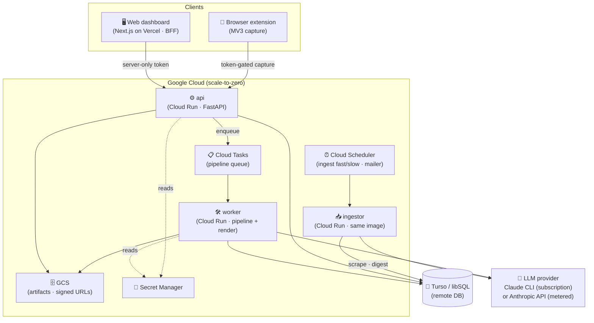

# ATS Resumaker

> Turn a job posting into a grounded, ATS-optimized **resume + cover letter + apply/no-apply decision** — traced strictly to a canonical profile, gated against fabrication.

ATS Resumaker is an accuracy-first, self-hostable job-application platform for a single user.
At its core is a deterministic pipeline that takes a job description (a URL or a page captured by
the browser extension), scrapes and structures it, scores match / gap / sponsorship / fit in
parallel, and — only on demand — tailors a resume and cover letter that trace every claim back to
your real profile. A mechanical **fact-gate** blocks any metric, employer, or title that isn't in
your source-of-truth profile. Around that pipeline is a full platform: a watchlist that
auto-onboards companies and ingests their postings, a one-click capture extension, a web dashboard
to triage and tailor, and an email digest. It is **human-in-the-loop by design — it advises and
drafts, it never auto-applies.**

<p>
  
  
  
  
  
  
  
</p>

---

## ✨ What it does

- 🔎 **Deterministic discovery** — an LLM-free feed of ingested postings, filterable by company,
  role, recency, location, and level. No resume-fit ranking (validated: it misranks).
- 🤖 **Agentic ATS-board onboarding** — give a company name (and optional careers URL) and an agent
  resolves its ATS board (Greenhouse, Lever, Ashby, Workday, iCIMS, and more); unresolved companies
  fall back to a manual entry.
- 🖱️ **One-click capture extension** — a Manifest V3 browser extension grabs the visible posting
  text plus a full-page screenshot and tracks it via the API, straight from any careers page.
- 📊 **Match / gap / sponsorship scoring** — parallel stages compute keyword fit, skill gaps, and
  visa-sponsorship signals, rolled up into a single apply / no-apply decision.
- 📝 **Grounded resume + cover generation** — tailoring, deterministic skills ranking, a
  DOCX→PDF render, ATS re-verification, and an ATS score — all traced to your profile.
- 🚫 **Mechanical anti-fabrication fact-gate** — a hard gate rejects any metric, employer, or title
  not present in your source-of-truth profile.
- 📬 **Email digest** — a scheduled digest of new on-target postings, decoupled from ingestion.
- ☁️ **Self-hostable on free tiers** — runs fully local (Docker/SQLite) or serverless on Cloud Run
  + Turso + Vercel, all within free tiers; the same code, config-selected.

## 📑 Table of contents

- [Architecture](#-architecture)
- [Tech stack](#-tech-stack)
- [Repository layout](#-repository-layout)
- [How it works](#-how-it-works)
- [Quick start](#-quick-start)
- [Configuration](#-configuration)
- [Security & privacy](#-security--privacy)
- [Credits & validation](#-credits--validation)
- [Roadmap](#-roadmap)
- [License](#-license)

## 🏗️ Architecture

A **modular monolith**, single-user, dual-mode. There are no microservices, no Redis, no Postgres,
and no load balancer. Every cloud dependency is a **config-selected adapter behind a seam with a
local default**, so the identical code runs fully on your machine *or* serverless.



### Components

| Component | Runtime | Responsibility |
|-----------|---------|----------------|
| **Browser extension** | Chrome MV3 (`extension/`) | Captures visible posting text + full-page screenshot; POSTs to the token-gated capture endpoint (independent of the web login). |
| **Web dashboard** | Next.js 15 on Vercel (`web/`) | Discovery / Tracker / Onboarding / Profile / Assistant / Mailer / Dashboard / Metrics UI. A **BFF**: a server-only token proxies the API so the secret never reaches the browser. |
| **api** | FastAPI on Cloud Run (`apps/api/`) | Runs, discovery, tracker, onboard, profile, mailer, dashboard, metrics; token auth; enqueues pipeline work. |
| **ingestor** | Cloud Run (same image as api) | Isolated service for watchlist ingestion + email digest, driven by Cloud Scheduler — kept off the user-facing api. |
| **worker** | Cloud Run (`apps/api/jobs/worker.py`) | Executes the CPU-bound pipeline (match / tailor / DOCX→PDF render), concurrency 1 per instance. |
| **Cloud Tasks** | GCP | The pipeline work queue (api enqueues → worker), with retries and rate limits. |
| **Cloud Scheduler** | GCP | Cron jobs: fast ingest, slow ingest (Workday-style throttled boards), and the mailer digest. |
| **Turso / libSQL** | Managed SQLite | The database; remote-only in cloud (no embedded replica → instant cold starts). |
| **GCS** | GCP | Artifact store (resumes, reports, screenshots) served via V4 signed URLs. |
| **Secret Manager** | GCP | All secrets (API token, Turso creds, LLM keys) injected into Cloud Run at deploy. |
| **LLM provider** | Claude CLI *or* Anthropic API | Provider-agnostic engine for cognitive stages, with automatic fallback and a deterministic-call cache. |

### Dual-mode seams

| Seam | Local default | Cloud adapter |
|------|---------------|---------------|
| Database (`persistence/db`) | SQLite `file:` | Turso / libSQL (remote-only) |
| Job queue (`apps/api/jobs/queue`) | in-process ThreadPool | Cloud Tasks → worker |
| Artifacts (`persistence/artifacts`) | local disk (inline) | GCS (signed URLs) |
| Scheduler | in-process APScheduler | Cloud Scheduler → ingestor |
| Onboarding agent runner | local Docker sandbox | GitHub Actions |
| LLM provider | Claude CLI (subscription) | Anthropic API (metered) / Claude CLI via OAuth token |

## 🧰 Tech stack

| Layer | Technology | Role |
|-------|-----------|------|
| **Backend** |  ·  | Core domain library (`src/resumaker`) + FastAPI service (`apps/api`); Pydantic v2 models, SSE progress. |
| | Pydantic · pydantic-settings · httpx · rapidfuzz | Typed models, config, async HTTP, fuzzy matching for keyword/skill scoring. |
| | python-docx · pypdf · pdfplumber · LibreOffice · Carlito | Resume rendering (DOCX→PDF) and ATS re-parse verification. |
| | curl-cffi · BeautifulSoup · lxml · Playwright (opt-in) | JD scraping with a headless-browser fallback tier. |
| **Frontend** |  ·  ·  | Dashboard + BFF (`web/`); framer-motion for UI; server-only token via middleware/session. |
| **Extension** | Chrome Manifest V3 (vanilla JS) | One-click capture: content script + service worker + debugger-based full-page screenshot. |
| **Data** |  / Turso (libSQL) | Local file DB or hosted libSQL; single schema, remote-only in cloud. |
| **Infra / Deploy** |  · Cloud Tasks · Cloud Scheduler · GCS · Secret Manager · Artifact Registry | Serverless, scale-to-zero backend. |
| |  ·  ·  ·  | IaC provisioning; keyless CI/CD via Workload Identity Federation; web on Vercel; Compose for local/VM. |
| **LLM** |  CLI · Anthropic API · Google Gemini (capped) | Provider-agnostic registry with fallback + deterministic cache. |

## 📁 Repository layout

```text
.
├── src/resumaker/        # Core domain library (pure logic, no web deps)
│   ├── config/           # pydantic-settings configuration + seam selection
│   ├── domain/           # Domain models (postings, runs, profile, scores)
│   ├── providers/        # llm/ (Claude CLI · Anthropic · Gemini registry) · scrape/ · sources/ (board adapters)
│   ├── stages/           # scrape → structure → keywords · gap · sponsorship → fit → apply → resume · cover
│   ├── ats/              # scorer · semantic · verify · skills_rank · fact_gate · sim/
│   ├── pipeline/         # Stage-DAG orchestrator + progress
│   ├── ingestion/        # onboard · discovery · tracker · service · scheduler · notify
│   ├── onboarding/       # Agentic ATS-board resolution (agent + sandbox/actions runner)
│   ├── persistence/      # files + SQLite/libSQL + cache + artifact store
│   └── observability/    # Structured logging + usage/cost accounting
├── apps/
│   ├── api/              # FastAPI: routers (runs, discovery, tracker, onboard, profile, mailer, dashboard, metrics, worker) + jobs/ queue + worker
│   └── cli/              # CLI: run · watch · ingest · onboard · discovery · track · schedule · costs · serve
├── web/                  # Next.js dashboard + BFF (Vercel)
├── extension/            # Chrome MV3 capture extension
├── deploy/               # Dockerfile.api · Dockerfile.worker · docker-compose · Caddyfile · terraform/ · systemd/
├── scripts/              # run-local.sh (and bootstrap helpers)
├── .github/workflows/    # deploy.yml (Cloud Run CI/CD) · onboard.yml (agentic onboarding runner)
├── docs/                 # PROJECT_DOCUMENTATION.md (deep architecture write-up) + research notes
├── tests/                # pytest suite (unit + eval; live tests opt-in)
├── SETUP.md              # Full setup guide (also rendered in-app at /setup)
└── RESUME_SYSTEM_BLUEPRINT.md  # The what/why: ATS/recruiter playbook
```

## ⚙️ How it works

The platform runs an application lifecycle on top of a single grounded pipeline:

1. **Onboard** — name a company (± careers URL); an agent resolves its ATS board, or you add it
   manually. The company joins your watchlist.
2. **Ingest** — Cloud Scheduler (or the local in-process scheduler) polls watchlist boards on two
   cadences (clean boards often; throttled Workday-style boards daily), dedupes, and stores new
   postings. Clean public boards use lightweight adapters; a Playwright tier is the fallback.
3. **Track** — add a posting and it runs the **match only** (fit / gap / sponsorship / keywords).
   Resume + cover are a deliberate on-demand trigger, never automatic. Applications move through
   `interested → applied → interview → offer / rejected / skipped`.
4. **Match** — parallel stages score keyword fit, skill gaps, and sponsorship, rolled into an
   apply / no-apply decision.
5. **Generate** — on demand: tailor → deterministic skills ranking → DOCX→PDF render →
   **fact-gate** → ATS re-verify → ATS score → cover letter. Every claim traces to your profile.
6. **Apply** — you review and download the artifacts, then apply yourself. The system never
   auto-applies. An email digest surfaces new on-target postings.

Per-posting pipeline, end to end:

```text
JD (URL or captured page)
  → scrape → structure
  → keywords · gap · sponsorship (parallel)
  → fit → apply-decision
  → resume (tailor · skills-rank · docx→pdf · fact-gate · ATS-verify · ATS-score)
  → cover letter
```

## 🚀 Quick start

Two ways to run: **Local (Docker)** on your machine, or **Self-hosting (cloud)** on Cloud Run +
Turso + Vercel within free tiers. Start local to try it. Full step-by-step instructions live in
[`SETUP.md`](SETUP.md) and are also rendered in-app at **`/setup`**.

Your profile is the source of truth for everything the system generates. Create it first via the
in-app **Assistant** page (three ways: fill a **first-time template** and seed it deterministically,
**upload a PDF/DOCX** to AI-parse and review, or **enrich by chat**), or hand-write
`data/profile/profile.json` from the schema in [`RESUME_SYSTEM_BLUEPRINT.md`](RESUME_SYSTEM_BLUEPRINT.md).
The profile is stored in the app database (the JSON file is the initial seed, migrated in on first
read). `data/` is gitignored and holds PII; it never leaves your machine or your bucket.

**Local (Docker):**

```bash
git clone https://github.com/AakashBelide/ATS_Resumaker2.git ats-resumaker && cd ats-resumaker
cp .env.example .env
#   set RESUMAKER_API_TOKEN=$(openssl rand -hex 24)
#   leave Claude CLI as the default provider, or set RESUMAKER_DEFAULT_PROVIDER=anthropic + ANTHROPIC_API_KEY
# add your profile: in-app Assistant page (template / upload / chat), or data/profile/profile.json

./scripts/run-local.sh                 # api + worker via docker compose; API -> http://localhost:8000

cd web && cp .env.local.example .env.local   # set API_ORIGIN, API_TOKEN, LOGIN_*, SESSION_SECRET
npm install && npm run dev             # dashboard -> http://localhost:3000
```

**Prefer the CLI (no Docker)?**

```bash
uv sync --all-extras
uv run python -m apps.cli serve                 # API at :8000
uv run python -m apps.cli onboard "Databricks"  # add a company to the watchlist
uv run python -m apps.cli run <jd-url>          # full pipeline on one posting
uv run python -m apps.cli discovery             # deterministic feed
uv run python -m apps.cli costs                 # LLM spend + budget
```

System deps for the CLI path: `brew install --cask libreoffice` and
`uv run playwright install chromium` (the worker Docker image bundles LibreOffice + Carlito + the
Claude CLI).

**Self-hosting (cloud):** provision GCP with `deploy/terraform/`, deploy on push to `main` via
GitHub Actions (keyless Workload Identity Federation), and import `web/` into Vercel. See
[`SETUP.md`](SETUP.md) section B for the full walkthrough.

## 🔧 Configuration

All configuration is via environment variables. Copy `.env.example` to `.env` (gitignored) and fill
it in. **Never commit real values.** The full annotated list is in `.env.example`; the essentials:

### Core & auth

| Variable | Purpose |
|----------|---------|
| `RESUMAKER_ENVIRONMENT` | Environment tag: `local` \| `vm` \| `ci`. |
| `RESUMAKER_API_TOKEN` | Bearer/`X-API-Key` token required on every `/v1` request. Required on any exposed instance. |

### LLM provider & model selection

| Variable | Purpose |
|----------|---------|
| `RESUMAKER_DEFAULT_PROVIDER` | Engine for cognitive stages: `claude` (CLI, subscription) \| `anthropic` (metered API) \| `gemini`. |
| `RESUMAKER_FALLBACK_PROVIDER` | Provider to fail over to when the primary errors/rate-limits (`anthropic` \| `gemini` \| blank). |
| `CLAUDE_CODE_OAUTH_TOKEN` | Personal-use OAuth token (`claude setup-token`) so the Claude CLI stays on the $0 subscription in the cloud. |
| `ANTHROPIC_API_KEY` | Required when the provider is `anthropic`. |
| `GEMINI_API_KEY` | Optional; Gemini path is hard-capped by the cost guard. |
| `RESUMAKER_MODEL_FAST` | Model for cheap extraction passes (e.g. Claude Haiku). |
| `RESUMAKER_MODEL_STANDARD` | Model for structuring / analysis / match (e.g. Claude Sonnet). |
| `RESUMAKER_MODEL_QUALITY` | Model for tailoring / fact-critical work (e.g. Claude Opus). |

### Serverless seams (leave blank for the local default)

| Variable | Purpose |
|----------|---------|
| `TURSO_DATABASE_URL` / `TURSO_AUTH_TOKEN` | Hosted libSQL database (both set → Turso; otherwise local SQLite). |
| `RESUMAKER_JOB_QUEUE` | `inprocess` (default) \| `cloud_tasks`. |
| `RESUMAKER_WORKER_URL` / `RESUMAKER_TASKS_QUEUE` | Worker target + queue name for Cloud Tasks. |
| `RESUMAKER_ARTIFACT_BACKEND` | `local` (default) \| `gcs`. |
| `RESUMAKER_GCS_BUCKET` / `RESUMAKER_GCP_PROJECT` / `RESUMAKER_GCP_REGION` | GCS + GCP targeting. |
| `RESUMAKER_ONBOARD_RUNNER` | Agentic onboarding sandbox: `docker` (default) \| `actions`. |
| `RESUMAKER_GITHUB_REPO` / `RESUMAKER_GITHUB_TOKEN` | GitHub Actions onboarding runner (`actions` mode). |

### Scheduler, digest & web

| Variable | Purpose |
|----------|---------|
| `RESUMAKER_SCHEDULER_ENABLED` | Enable the in-process watchlist poller (local); leave `false` in cloud (Cloud Scheduler drives it). |
| `RESUMAKER_SCHEDULER_INTERVAL_MINUTES` / `..._WORKDAY_INTERVAL_MINUTES` | Poll cadences for clean vs. throttled boards. |
| `RESUMAKER_RESEND_API_KEY` / `RESUMAKER_NOTIFY_TO` / `RESUMAKER_NOTIFY_FROM` | Email digest via Resend (send-only key). |
| `RESUMAKER_NOTIFY_WEBHOOK` | Optional Slack/Discord webhook for a JSON digest. |
| `API_ORIGIN` / `API_TOKEN` (web) | Server-only BFF config: the Cloud Run api URL + the matching `RESUMAKER_API_TOKEN`. |
| `LOGIN_USERNAME` / `LOGIN_PASSWORD` / `SESSION_SECRET` (web) | The web login gate — **fails closed** if unset. |

> Use placeholders like `<your-api-url>` and `<your-gcp-project-id>` when documenting; the real
> values belong only in your local `.env`, `deploy/terraform/terraform.tfvars`, and your host's
> secret store.

## 🔒 Security & privacy

- **PII stays put.** `data/` (which holds `data/profile/profile.json` with your contact info),
  `.env` / `.env.*`, generated `outputs/`, and Terraform state (`*.tfstate`) plus
  `terraform.tfvars` are all **gitignored** and never committed. PII never leaves your machine or
  your own bucket.
- **Token-gated API.** Every `/v1` request requires `RESUMAKER_API_TOKEN`. The extension's capture
  endpoint is token-gated and size-bounded.
- **BFF, not client secrets.** The web app keeps the API token server-side; it is never exposed as
  a `NEXT_PUBLIC_*` var. The login gate **fails closed** — if the login vars aren't set, the
  deployed app locks everyone out rather than opening up.
- **Keyless CI/CD.** Deploys authenticate to GCP via Workload Identity Federation — no long-lived
  service-account key lives in the repo. Runtime secrets are injected from Secret Manager.
- **Claude CLI OAuth is personal-use only.** `claude setup-token` authorizes *your* subscription;
  running it on a shared/hosted server may violate Anthropic's ToS. For a truly hosted instance,
  use the metered Anthropic API instead.
- **Human-in-the-loop.** The system advises, scores, and drafts. **It never auto-applies.**

## 🎓 Credits & validation

ATS Resumaker is synthesized and rebuilt from lessons across three studied projects:

- **career-ops** — https://github.com/santifer/career-ops
- **Job-Ops** — https://github.com/dakheera47/Job-Ops
- **ATS Resumaker v1** — https://github.com/AakashBelide/ATS-Resumaker

Output quality is validated against real, independent tooling — not just self-scoring:

- Generated resumes are parsed with **Affinda** (https://www.affinda.com/), an industry resume-parsing
  oracle, to confirm the ATS layer sees the same structured fields a real ATS would.
- Resumes are imported into **OpenCATS** (https://github.com/opencats/OpenCATS), a real open-source
  applicant tracking system, to confirm they ingest cleanly end to end.

## 🗺️ Roadmap

- Harden the worker to a private Cloud Run service with OIDC-authenticated invocation (currently
  public but token-gated in-app).
- Optional headless/stealth scraping tier for bot-protected custom career sites (evaluated and
  intentionally deferred; see `docs/JOB_INGESTION_RESEARCH.md`).
- Broaden ATS-board adapter coverage as new boards appear on the watchlist.

## 📄 License

Released under the [MIT License](LICENSE). You are free to use, modify, and self-host it; the
software is provided as-is, without warranty.
